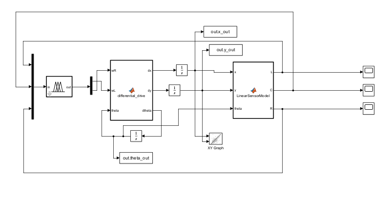
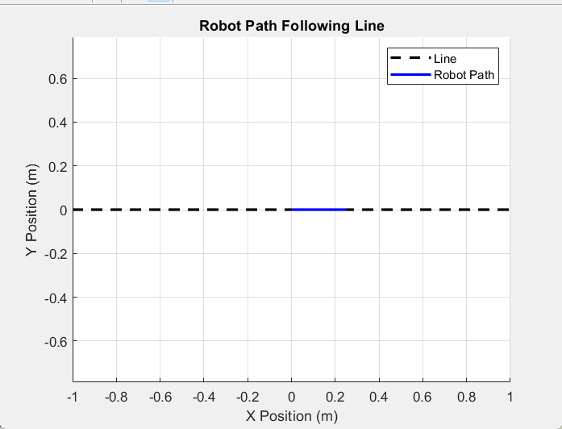

# Line Follower Robot Using Fuzzy Logic Controller

- 

## Introduction

The Line Following Robot project demonstrates the use of a Fuzzy Logic Controller (FLC) to control a two-wheel differential drive robot that follows a line. The robot uses sensors to detect the line and adjusts its movement to stay on track. Fuzzy logic provides a method of control that mimics human reasoning and decision-making, making it suitable for applications where precise control is difficult to achieve with traditional methods.

## What is Fuzzy Logic?

Fuzzy Logic is a form of logic that deals with reasoning that is approximate rather than fixed and exact. Unlike binary logic, which relies on clear true or false values (1 or 0), fuzzy logic allows for partial truth values, typically ranging between 0 and 1. It mimics human decision-making, where things are not always black and white but can have varying degrees of truth. It is widely used in control systems, image processing, and various other engineering applications.

## What is Mamdani Fuzzy Logic?

Mamdani Fuzzy Logic is one of the most common fuzzy inference systems, which was proposed by Ebrahim Mamdani in 1975. It uses fuzzy IF-THEN rules to make decisions. In this system, the fuzzy inputs are processed using membership functions, and the output is a fuzzy set, which is then defuzzified into a crisp value. Mamdani Fuzzy Logic is often preferred in control systems due to its simplicity and ability to handle complex systems intuitively.

## Components of a Fuzzy Logic Controller

A Fuzzy Logic Controller (FLC) is composed of several components:

1. **Crisp Input**: The input received by the FLC, typically from sensors (e.g., sensor values for position or error).
2. **Fuzzification**: The process of converting the crisp input into fuzzy values using membership functions.
3. **Fuzzy Variables**: The linguistic variables used in the system (e.g., ‘small’, ‘medium’, ‘large’ for error or speed).
4. **Fuzzy Logic Rules**: The set of rules that defines the system’s behavior. These are typically in the form of IF-THEN statements.
5. **Defuzzification**: The process of converting the fuzzy output into a crisp value, which can be used to control the system.
6. **Crisp Output**: The final output of the FLC, which is used to control the robot or system.

## Mathematical Model for Differential Drive Robot

The differential drive robot model consists of two wheels that independently control the motion of the robot. The robot’s position is described by its coordinates (x, y) and its orientation (theta). The robot moves forward by adjusting the speed of the left and right wheels, which results in a rotational movement depending on the difference in speed between the two wheels.

## Linear Sensor Model Logic

The linear sensor model is designed to detect whether the robot's sensors are over the black line. The code calculates the world coordinates of the center, left, and right sensors based on the robot's position and orientation. It then checks if the sensors are over the line by comparing the y-coordinates with a defined tolerance. If the sensor’s y-coordinate is within the tolerance range, it indicates that the sensor is over the line. The output consists of three Boolean values representing whether the center, left, and right sensors detect the line.

## Working of Fuzzy Logic Controller

The Fuzzy Logic Controller works by receiving inputs from the line-following sensors and processing them through a series of fuzzy logic rules. The controller adjusts the speed of the left and right wheels to ensure the robot follows the line. For example, if the robot veers off to the left, the FLC might increase the speed of the right wheel to bring the robot back on track. The system uses a set of rules such as:

- **IF the left sensor detects the line, THEN the right wheel speed should increase.**
- **IF the right sensor detects the line, THEN the left wheel speed should increase.**

These rules are implemented using fuzzy membership functions, and the output is defuzzified to determine the precise motor control.

- 

## Future Scope

There are several potential areas for future improvement and expansion:

- **S-Shaped Curve** 
- **Fuzzy Tuning**
- **More Complex Curves**

---

